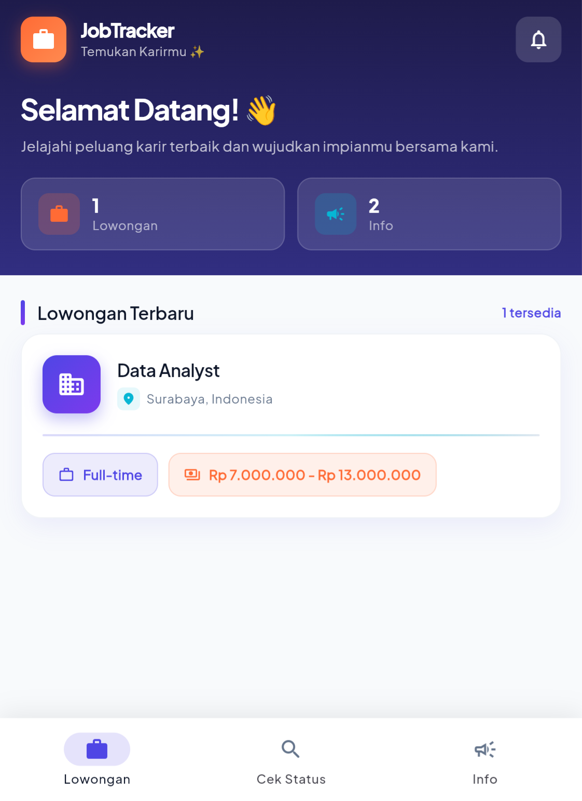
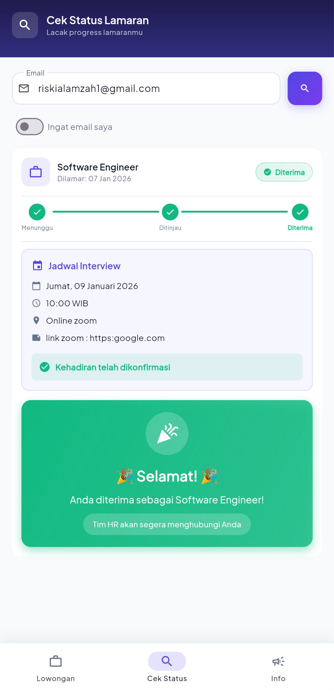
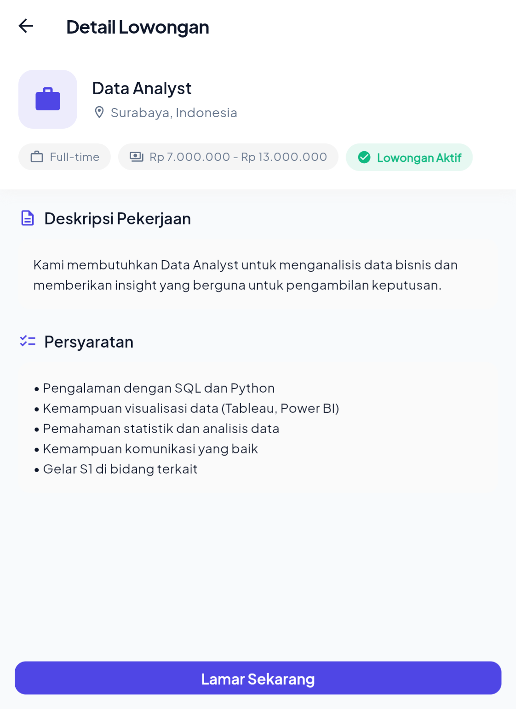

# 📱 JobTracker ATS

<div align="center">


**Aplikasi Applicant Tracking System (ATS) berbasis Flutter**

_Temukan karir impianmu dengan mudah! ✨_

</div>

---

## 📖 Tentang Aplikasi

**JobTracker ATS** adalah aplikasi mobile untuk mengelola proses rekrutmen karyawan. Aplikasi ini memiliki dua sisi pengguna:

- **👤 Pelamar (Guest)**: Melihat lowongan, melamar pekerjaan, dan melacak status lamaran
- **👨‍💼 Admin (HR)**: Mengelola lowongan, meninjau pelamar, menjadwalkan interview, dan memberikan keputusan

---

## ✨ Fitur Utama

### Untuk Pelamar

| Fitur                    | Deskripsi                                      |
| ------------------------ | ---------------------------------------------- |
| 🔍 **Jelajahi Lowongan** | Lihat daftar lowongan pekerjaan yang tersedia  |
| 📝 **Lamar Pekerjaan**   | Isi formulir lamaran dengan mudah              |
| 🎙️ **Voice Input**       | Isi lamaran menggunakan suara (speech-to-text) |
| 📄 **Upload CV**         | Upload CV dan parsing otomatis dengan AI       |
| 📊 **Cek Status**        | Lacak progress lamaran dengan timeline visual  |
| 📢 **Info/Pengumuman**   | Lihat pengumuman terbaru dari perusahaan       |
| 🎉 **Status Visual**     | Tampilan menarik untuk status Diterima/Ditolak |

### Untuk Admin

| Fitur                   | Deskripsi                                        |
| ----------------------- | ------------------------------------------------ |
| 📋 **Kelola Lowongan**  | Tambah, edit, buka/tutup lowongan                |
| 👥 **Daftar Pelamar**   | Lihat semua lamaran dengan sorting & grouping    |
| 🤖 **AI Scoring**       | Penilaian otomatis pelamar menggunakan Gemini AI |
| 📅 **Jadwal Interview** | Atur jadwal dengan validasi konflik otomatis     |
| ✅ **Keputusan**        | Terima/Tolak pelamar dengan satu klik            |
| 📢 **Kelola Info**      | CRUD pengumuman/broadcast                        |

---

## 🛠️ Tech Stack

- **Framework**: Flutter 3.x
- **Bahasa**: Dart
- **Database**: Supabase (PostgreSQL)
- **State Management**: Provider
- **AI Integration**: Google Gemini API
- **Routing**: go_router
- **Lainnya**: speech_to_text, file_picker, intl

---

## 📸 Screenshots

<div align="center">

|                Halaman Depan                 |                     Cek Status                     |                     Detail Lowongan                     |
| :------------------------------------------: | :------------------------------------------------: | :-----------------------------------------------------: |
|  |  |  |

</div>

---

## 🚀 Cara Menjalankan

### Prerequisites

- Flutter SDK (>=3.0.0)
- Dart SDK (>=3.0.0)
- Akun Supabase

### Langkah-langkah

1. **Clone repository**

   ```bash
   git clone https://github.com/username/apps_tracking.git
   cd apps_tracking
   ```

2. **Install dependencies**

   ```bash
   flutter pub get
   ```

3. **Setup Supabase**

   - Buat project di [Supabase](https://supabase.com)
   - Jalankan SQL schema dari `supabase_schema.sql`
   - Update kredensial di `lib/services/supabase_service.dart`

4. **Jalankan aplikasi**
   ```bash
   flutter run
   ```

---

## 📁 Struktur Folder

```
lib/
├── config/           # Tema dan konfigurasi
├── models/           # Data models (Job, Application, Interview, etc.)
├── providers/        # State management (AppProvider)
├── repositories/     # Data layer (API calls)
├── screens/
│   ├── admin/        # Halaman admin (Dashboard, Kelola Lowongan, etc.)
│   └── guest/        # Halaman pelamar (Home, Detail, Apply)
├── services/         # External services (Supabase, Gemini AI)
├── widgets/          # Reusable widgets
└── main.dart         # Entry point
```

---

## 🔐 Kredensial Admin

Untuk mengakses panel admin:

- **Username**: `admin`
- **Password**: `admin123`

> 💡 **Tip**: Long-press logo di halaman utama untuk melihat opsi login admin

---

## 🎨 Design System

Aplikasi menggunakan tema **Glints-inspired** dengan:

- **Primary Color**: Indigo (`#5C6BC0`)
- **Secondary Color**: Cyan (`#00BCD4`)
- **Accent Color**: Orange (`#FF7043`)
- **Font**: Plus Jakarta Sans (Google Fonts)

---

## 👥 Tim Pengembang

| Nama                    | NIM          |
| ----------------------- | ------------ |
| Riski Putra Alamzah     | 221080200100 |
| Muhammad Sulthon Abiyyu | 221080200036 |
| Muhammad Aufa Izul Haq  | 221080200021 |

---

## 📄 Lisensi

Project ini dibuat untuk **Tugas Kelompok Mata Kuliah Pemrograman Mobile** - Semester 7

---

<div align="center">

**Made with ❤️ using Flutter**

</div>
